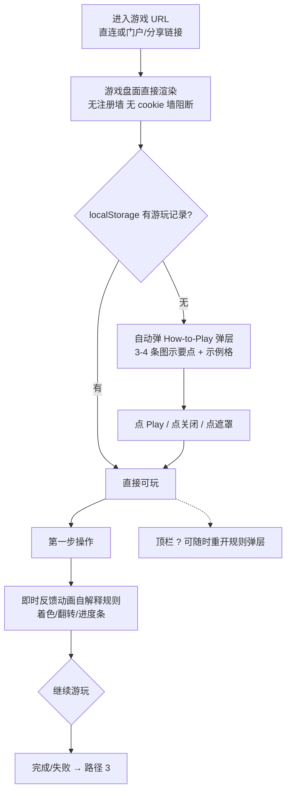
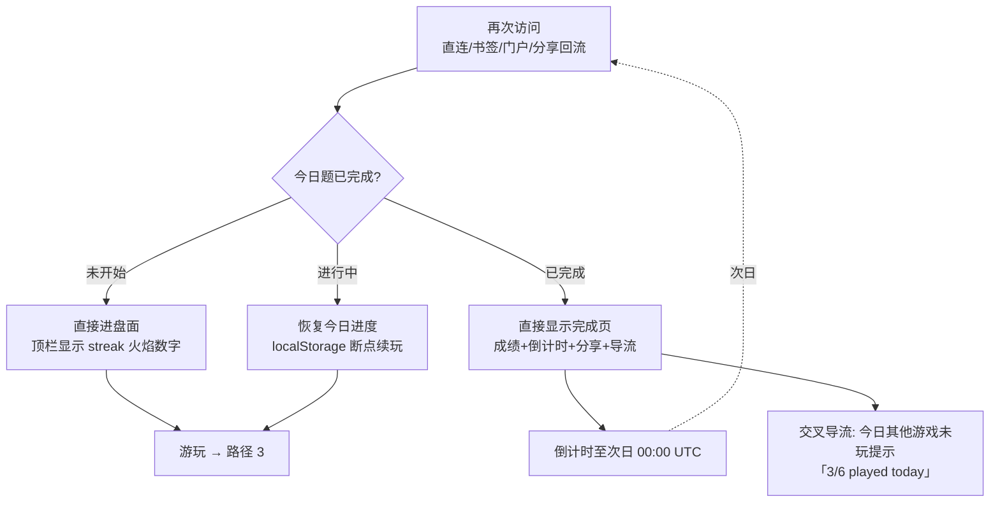
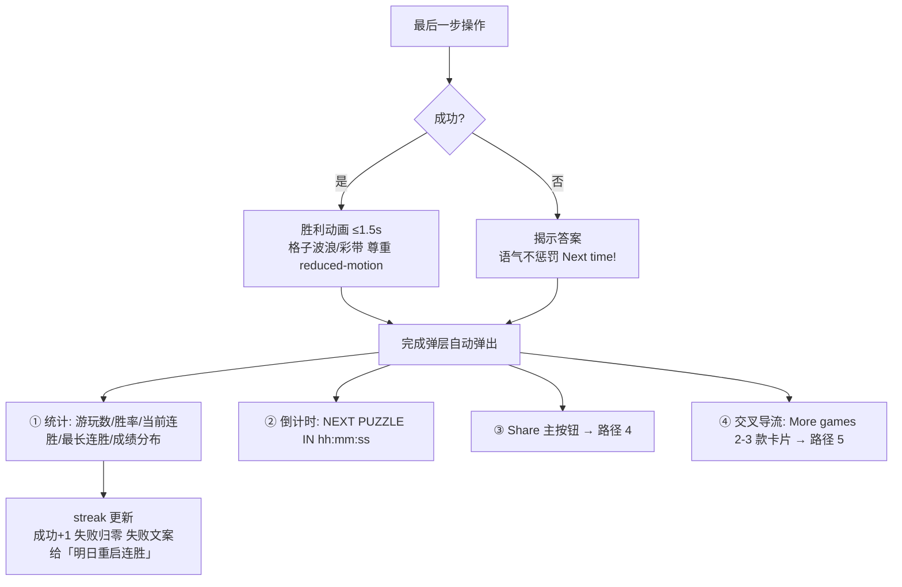
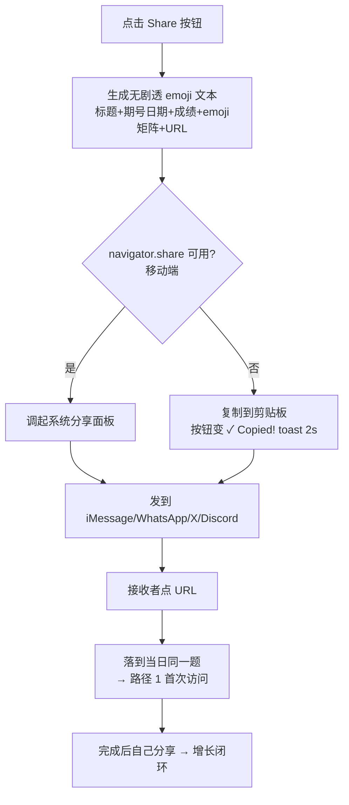
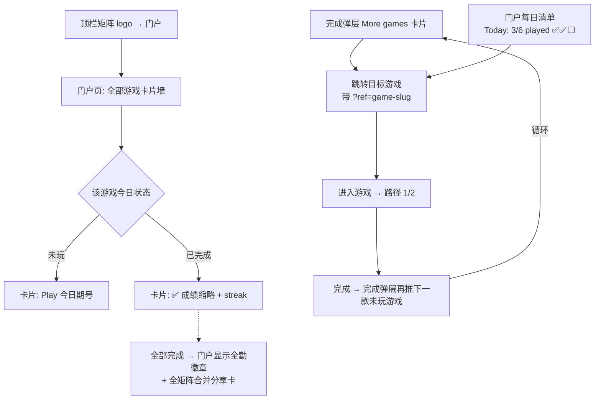

# Daily Games 每日游戏矩阵 — UX 研究与交互流程（UX-FLOWS.md）

- 作者：ux-researcher / ui-designer（协作产出）
- 日期：2026-07-31
- 输入：竞品走查（NYT Games：Wordle / Connections / Strands；Linxicon；Globle；neal.fun / Infinite Craft）+ projects/daily-games/ 调研报告
- 对标基准：NYT Games 的体验水准、Wordle 的分享机制（项目一页纸 §竞品对标对象）

---

## 一、竞品走查：核心交互模式对比

| 维度 | Wordle | Connections | Strands | Linxicon | Globle | neal.fun / Infinite Craft |
|---|---|---|---|---|---|---|
| 注册墙 | 无（登录仅用于跨设备同步） | 无 | 无 | 无 | 无 | 无 |
| 首屏 | 直接进入棋盘（NYT 加了一层"Play"欢迎页，但一键即玩） | 直接进入 4×4 网格 | 直接进入字母网格 | 直接进入输入框 | 直接进入 3D 地球 | 直接进入画布 |
| 规则呈现 | 首次访问自动弹 How-to-Play 弹层，之后收进顶栏 ? 图标 | 同左 | 同左 | 内嵌一句话说明 | 首次弹层 | 无规则（探索即规则） |
| 每日机制 | 全球同一题，午夜（本地时区）换题 | 同左 | 同左 | 每日一对词 | 每日一国 | 无每日限制（无限玩法） |
| 次数限制 | 6 次猜测 | 4 次错误机会 | 无限但有 hint 代价 | 无限猜测计分 | 无限猜测计次 | 无限制 |
| 反馈方式 | 格子翻转着色（🟩🟨⬛），逐格延迟动画 | 整行摇晃/上浮归组，"one away" 微提示 | 找到词高亮连线 | 相似度百分比进度条 | 猜测国着色（冷暖色距离梯度） | 新合成物弹出 + "First Discovery" 徽章 |
| 完成页 | 弹层：统计（游玩数/胜率/连胜/分布）+ 倒计时 + Share 按钮 | 弹层：结果 emoji 矩阵 + 倒计时 + Share | 同左 | 结果卡 + 分享 | 结果 + 猜测次数分享 | 无完成态（持续探索） |
| 分享格式 | 纯 emoji 矩阵，无剧透（不含答案字母） | 🟨🟩🟦🟪 行序矩阵，暴露解题顺序但不暴露答案 | 💡🔵 序列 | 文字+次数 | 🟥🟧🟨🟩 渐进色带 | 截图/链接 |
| 连胜机制 | streak + 最长 streak，本地存储 | streak | streak | streak | streak | 无 |
| 失败体验 | 显示答案，统计照常记录，倒计时引导明日回访 | 显示正确分组，语气不惩罚（"Next Time!"） | 不存在失败（无限时间） | 无失败态 | 无失败态（猜到为止） | 无失败态 |
| 跨游戏导流 | NYT Games 门户 + 完成弹层内推荐其他游戏入口 | 同左 | 同左 | 无 | 底部友链 | neal.fun 项目列表页 |

### 走查关键发现（对我们的设计约束）

1. **零摩擦是底线**：所有头部每日游戏「URL→可玩」不超过 1 次点击、不超过 2 秒；无注册墙、无强制弹窗链。NYT 的 Play 欢迎页是品牌层，我们矩阵门户承担该层，**单款游戏页必须直接进入盘面**。
2. **规则渐进呈现**：首次访问自动弹一次 How-to-Play（3-4 条图示要点，非长文），关闭后永久收进 ? 图标；玩家实际靠第一次猜测的反馈学会规则——因此**第一步操作的反馈必须自解释**（着色/动画/文案）。
3. **完成页是留存与增长引擎**，四件套缺一不可：统计（个人历史）→ 倒计时（明日回访钩子）→ 分享（增长）→ 交叉导流（矩阵内 LTV）。NYT 完成弹层顺序即此优先级。
4. **连胜是最强回访机制**：streak 数字 + 「不要断」损失厌恶。必须本地持久化（localStorage），并在完成页与门户上都可见。
5. **失败不惩罚**：失败也给完成页四件套；语气用 "Next time!"，答案必须揭示（好奇心闭环），统计照常累计（游玩数与分布），只有 streak 中断。
6. **分享格式的三条铁律**（Wordle 公式）：①纯文本+emoji，任何聊天软件可粘贴；②无剧透（不含答案本体）；③一眼可读的"成绩叙事"（几行=几次尝试）。
7. **AI 原生玩法（Infinite Craft 型）差异点**：无失败态、以"发现"为奖励（First Discovery 徽章）、会话时长长——适合作矩阵的"长停留锚点"，但每日模式需人为加目标（每日目标物/每日案件）才有完成页与分享闭环。

---

## 二、每日游戏体验公式

```
每日游戏体验 =
  首屏即玩（0 注册墙，≤1 点击进盘面，首屏可交互 <2s）
+ 规则渐进（首访一次性 How-to 弹层 → ? 图标常驻 → 首步反馈自解释）
+ 有限挑战（每日一题 · 全球同题 · 有限次数或有限提示 → 稀缺感与公平感）
+ 即时反馈（每步操作 ≤300ms 内给着色/动画/触觉反馈）
+ 完成页四件套（统计 → 倒计时 → 分享 → 交叉导流，失败同享）
+ 连胜机制（streak 本地持久化 + 损失厌恶提示）
+ 无剧透分享（emoji 矩阵：标题+日期期号+成绩+URL）
```

落地为验收硬指标：
- 首屏可交互（TTI）< 2s（移动 4G）；游戏页无任何前置弹窗（除首访 How-to）
- 任意一步操作反馈 < 300ms；完成页在最后一步动画结束后 ≤1.5s 自动弹出
- 分享文本在 iOS/Android/微信/Discord/X 粘贴均不破版
- 失败路径与成功路径的完成页功能完全等价

---

## 三、五条路径交互流程图

### 路径 1：首次访问（First Visit）



要点：How-to 弹层只自动弹一次（`localStorage.seenHelp_{game}`）；弹层内容 ≤1 屏，配 1 个动效示例格；关闭方式 ≥3 种（按钮/×/遮罩）。

### 路径 2：每日回访（Daily Return）



要点：日期以**统一每日种子（UTC）**判定；已完成再访**不允许重玩今日题**（保护全球同题公平性与分享可信度）；进行中状态必须可恢复（防误关流失）。

### 路径 3：完成（Completion — 成功与失败同构）



要点：弹层可关闭，关闭后盘面上方常驻一条「结果条」（成绩 + Share + 倒计时缩略）可随时唤回；统计全部本地存储，无账号。

### 路径 4：分享（Share）



要点：分享文本格式全矩阵统一（见 DESIGN.md §9）；URL 带 `?utm_source=share` 供归因；绝不生成图片附件（纯文本兼容性最高、体积为零）。

### 路径 5：跨游戏导流（Cross-Promotion）



要点：导流只在**完成后**出现（不打断原则，广告同理）；推荐排序 = 今日未玩优先 → 品类互补（词类完成推数字/地理）；门户是"每日清单"心智（像 NYT Games 首页），全勤合并分享卡是矩阵独有的二次分享钩子。

---

## 四、UX 改进清单（按影响/成本排序，供工程实现参考）

| # | 建议 | 理由 | 预期收益 | 成本 |
|---|---|---|---|---|
| 1 | 完成页四件套作为全矩阵共享组件 | 六款游戏行为一致，NYT 同款心智 | 回访率/分享率基线 | 低（一次实现） |
| 2 | streak + 每日清单门户 | 最强回访钩子叠加矩阵优势 | DAU 留存 | 低 |
| 3 | 进行中状态断点续玩 | 移动端切后台/误关高频 | 减少当日流失 | 低 |
| 4 | navigator.share + 剪贴板双通道 | 移动端原生面板转化率高于复制 | 分享率 | 低 |
| 5 | 首步反馈自解释（规则可跳过仍能学会） | 走查确认玩家不读规则 | 首玩完成率 | 中 |
| 6 | 失败路径同构完成页 | 失败者也是分享者与回访者 | 留存 | 低 |
| 7 | AI 玩法加"每日目标物/每日案件"目标层 | 补齐无限玩法缺失的完成/分享闭环 | AI 款分享率 | 中 |
| 8 | 全勤徽章 + 矩阵合并分享卡 | 矩阵独有增长机制，竞品没有 | 交叉导流率 | 中 |
